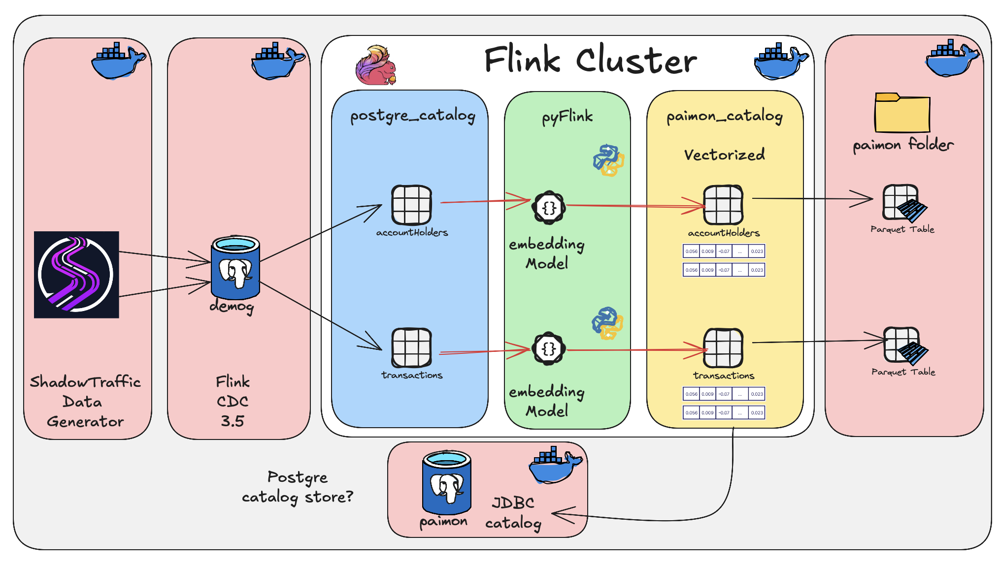

## Using Pyflink UDF to calculate embedding vectors on inbound tables via Flink CDC

So, the original idea, generate data, do embedding using Pyflink, store into a lakehouse, simple.

Well mission accomplished, even if we did changed some of the original outputs, will see ifi can circle back on the next demo/blog... ye, there is another one already drawn out, started.

Our little project, create accountHolder records (that defines a person, family at an address) and then financial transactions (well who can life without spending money) modeled as a outbound and inbound event, very real world.

These are all inserted into a PostgreSQL database/tables.

We then utilize Apache Flink CDC to consume these into trancient tables inside Apache Flink (we're using Generic in memory catalog).

Next up, we need to do the embedding calculation, this is done using two Pyflink User Defined functions (UDF), (See: `<Project root/devlab/pyflink/udfs/`).

These are called as per below, as inline function calls, returning the embedding vector that is inserted into our lakehouse, based on Apache Paimon.

```sql
Insert into c_paimon.finflow.<target table>
select (
        fields
    , ...
    , ...
    ,generate_<function>_embedding(
            fields
        , ...
        , ...
    ) AS embedding_vector
    ,384                    AS embedding_dimensions
    ,CURRENT_TIMESTAMP      AS embedding_timestamp
    ,created_at
) 
from c_cdcsource.demog.<source table>;~
```

 
BLOG: [Using Pyflink UDF to calculate embedding vectors on inbound tables via Flink CDC](https://medium.com/@georgelza/using-pyflink-udf-to-calculate-embedding-vectors-on-inbound-tables-via-flink-f77ce605a429)

GIT REPO: [PyFlink_Embedder](https://github.com/georgelza/PyFlink_Embedder.git)


## Overview

The stack allows for the Lakehouse tables to either be created on S3 Object storage hosted on MinIO container or on the local file system `<Project root/devlab/data/flink/paimon/`.

### S3/ MinIO


### Filesystem
  



## Deployment

- Bring our stack up based on `<Project Root>/devlab/docker-compose.yml` or `<Project Root>/devlab/docker-compose-fs.yml`, by executing either of the following 2(both of these will use `.env` environment file with some variables, also notice the `.pwd` for some "secrets").
  
  - Deploy stack `make run`                       -> Run MinIO/S3 based version.

  - Deploy stack `make run-fs`                    -> Run Filesystem based version.

- Next we need to build our catalogs and tables,

  - Deploy catalog and tables  `make deploy`      -> Run MinIO/S3 based version.

  - Deploy catalog and tables `make deploy-fs`    -> Run Filesystem based version.


**NOTE:** For the above deploy I ran into an interesting situation. As you will notice the `PostgreSQL` source table is created in the `c_cdcsource` catalog. Now that catalog is of type `generic in memory` as per **Apache Flink**. So whats so special about that, well, it’s session scoped, **ONLY**. This means whatever you create in the catalog is only available/visible for that session, during that session. 

Ok. Now this means when we create the catalog, the source `PostgreSQL` reference, the UDF referencing the source table, well, they all have to be done in one session. So… how did we get around this, why is this a issue. Well we still want to compartmentalise our code, as in keep the catalog create in the catalog script, the CDC source table creates in their script and then the UDF separate as well as its registration. 

Code duplication is also note a great idea, we want to re-use these bits.

So at this point, I’m going to say, look at our `Makefile`, at the deploy: and deploy-fs: sections, and how they call `master:` or `master-fs:`, and how we use the “>” operator to build a `master.sql` or `master-fs.sql` script, which we then execute in `deploy:` or `deploy-fs:`. 

There is still room for improvement here, but for now this worked.

**MinIO/S3 based deployment**

The below is from our docker-compose.yaml and docker-compose-fs.yaml files

```bash
# S3/Minio based  => Default
master:
	@echo "-- Generated MinIO/S3 master.sql" > ./creFlinkFlows/master.sql
	@cat ./creFlinkFlows/scripts/1.1.creCat.sql >> ./creFlinkFlows/master.sql
	@cat ./creFlinkFlows/scripts/3.1.creTargetFinflow.sql >> ./creFlinkFlows/master.sql
	@cat ./creFlinkFlows/scripts/3.2.creTargetCmplx.sql >> ./creFlinkFlows/master.sql
	@echo "✅ master.sql for MinIO/S3 generated"

deploy: master
	@echo "Deploying Paimon based Catalog with MinIO/S3 Storage..."
	docker compose exec --interactive --tty jobmanager /opt/flink/bin/sql-client.sh -f /creFlinkFlows/master.sql
```

**File System based deployment**

```bash
# File System based
master-fs:
	@echo "-- Generated fs master.sql" > ./creFlinkFlows/master-fs.sql
	@cat ./creFlinkFlows/scripts/1.1.creCat-fs.sql >> ./creFlinkFlows/master-fs.sql
	@cat ./creFlinkFlows/scripts/3.1.creTargetFinflow.sql >> ./creFlinkFlows/master-fs.sql
	@cat ./creFlinkFlows/scripts/3.2.creTargetCmplx.sql >> ./creFlinkFlows/master-fs.sql
	@echo "✅ master-fs.sql for FS generated"

deploy-fs: master-fs
	@echo "Deploying Paimon based Catalog with Filesystem..."
	docker compose exec --interactive --tty jobmanager /opt/flink/bin/sql-client.sh -f /creFlinkFlows/master-fs.sql
```

Let’s continue…

- Deploy our PyFlink UDF

  - `make ahs`      -> Deploy our accountHolder embedding flow as a Apache Flink job

  
  - `make txns`     -> Deploy our transaction embedding flow as a Apache Flink job


- Generate data,

  - Execute our `Shadowtraffic` based data generator to create our data products for #1 AccountHolders, #2 Financial Transactions tables.
    This will Ooutput into two PostgreSQL Tables provided by our `postgrescdc` docker-compose service.
    The data generation is run by executing `<Project Root>/shadowtraffic/run_pg1.sh`.
    If you want to increase the data generate rate execute `<Project Root>/shadowtraffic/run_pg2.sh`.


## Regarding our Stack

The following stack is deployed using one of the provided  `<Project Root>/devlab/docker-compose-*.yaml` files as per above.

- [Apache Flink 1.20.2](https://nightlies.apache.org/flink/flink-docs-release-1.20/)                   

- [Apache Flink CDC 3.5.0](https://nightlies.apache.org/flink/flink-cdc-docs-release-3.5/)

- [Apache Paimon 1.3.1.](https://paimon.apache.org)

- [PostgreSQL 12](https://www.postgresql.org)

- [MinIO](https://www.min.io) - Project has gone into Maintenance mode... 

- [ShadowTraffic](https://shadowtraffic.io)


## Data Products 

Below is a overview of the data products we will create using Shadowtraffic, these will be inserted into our PostgreSQL CDC datastore.

From were they will be CDC source into our Flink environment into Flink tables that will be "consumed" using PyFlink jobs, first flattened and then as a 2nd job calculate vector embeddings (using different local [HuggingFace](https://huggingface.co) LLM models).


### 1. AccountHolders

```bash
_id                                                     => Sequentially incrementing value
nationalid                                              => Random 16 Digits unique Number, excluded from embedding calc
    firstname
    lastname
    dob                                                 => YY/MM/DD   Min = current - 16yrs
    gender
    children
    address                                             => Can we drive addresses chosen based on country via .env value 
    {
        Street Address
        Suburb
        Town
        Province
        Country
        Postal Code
    }
    accounts [
        # (1-5)                                         => .env driven
        Bank Account/s
            tenantId                                    => .env driven (PickList / or from PostgreSql Table of possible values)
                                                        => this becomes the tenantId, fromId, toId
            memberName                                  => .env driven (PickList / or from PostgreSql Table of possible values)
            bicFi                                       => .env driven (PickList / or from PostgreSql Table of possible values)
                                                        => this becomes the fromId or toId, possible same as tenantId
            brancId                                     => .env driven (PickList / or from PostgreSql Table of possible values)
                                                        => this become the fromBranchId or toFIBranchId
            accountId                                   => concat bicfi-<random-unique-16>
                                                        => this is either the accountId or counterPartyAccountId
            accountType                                 => .env driven (PickList / or from PostgreSql Table of possible values)
            accountOpenDate
        Credit Card/s
            issuingBank (tenantId)                      => .env driven (PickList / or from PostgreSql Table of possible values)
            bicFi                                       => .env driven (PickList / or from PostgreSql Table of possible values)
            cardNumber                                  => CC Structure, can we maybe pick first 4 chars from .env pick list (known as bin numbers) 
            cardType (VISA/MasterCard/Amex/DinerClub)   => .env driven (PickList / or from PostgreSql Table of possible values)
            expDate                                     => Current mm/year - <.env driven # months>
    ]
    emailaddress
    mobilephonenumber
    embedding_vector                                     => To be Calculated, Account Holder profile model 
    embedding_dimensions
    embedding_timestamp
    created_at

```

### 2. Financial Transactions

### Outbound Txn: From Payer to Payee

```bash
    _id                                                 => Sequentially incrementing value
    eventId                                             => UUIDv7   Unique, excluded from embedding calc
    transactionid                                       => UUIDv7   Shared with Inbound, excluded from embedding calc
        eventtime                                       => "2023-07-31T12:59:02"
        direction: outbound
        eventtype
        creationdate
        accountholdernationalid
        accountholderaccount                            => row
        counterpartynationalid
        counterpartyaccount                             => row
        tenantid
        fromid
        accountagentid
        fromfibranchid
        accountnumber
        toid
        accountidcode
        counterpartyagentid
        tofibranchid
        counterpartynumber
        counterpartyidcode
        verificationresult                              => .end driven (pick List)
        amount {                                        => row
            basecurrency                                => .env driven (pick List)
            basevalue
            roe                                         => .env driven 
            currency                                    => .env driven (pick List)
            value
        }
        msgType                                         => .end driven (pick List)
        settlementclearingsystemcode
        paymentclearingsystemreference
        requestexecutiondate
        settlementdate
        destinationcountry
        localinstrument
        msgstatus
        paymentmethod
        settlementmethod
        transactiontype
        verificationresult
        numberoftransactions
        schemaversion
        usercode
        embeddingVector                                 => To be Calculated, transaction profile model 
        embedding_dimensions
        embedding_timestamp
        created_at
  ```

### Inbound Txn: To Payee from Payer

(separate insert/record into Transaction table)

```bash
    _id                                                 => Sequentially incrementing value
    eventId                                             => UUIDv7   Unique, excluded from embedding calc
    transactionid                                       => UUIDv7   Shared with Inbound, excluded from embedding calc
        eventtime                                       => "2023-07-31T12:59:02"
        direction: inbound
        eventtype
        creationdate
        accountholdernationalid
        accountholderaccount                            => row
        counterpartynationalid
        counterpartyaccount                             => row
        tenantid
        fromid
        accountagentid
        fromfibranchid
        accountnumber
        toid
        accountidcode
        counterpartyagentid
        tofibranchid
        counterpartynumber
        counterpartyidcode
        verificationresult                              => .end driven (pick List)
        amount {                                        => row
            basecurrency                                => .env driven (pick List)
            basevalue
            roe                                         => .env driven 
            currency                                    => .env driven (pick List)
            value
        }
        msgType                                         => .end driven (pick List)
        settlementclearingsystemcode
        paymentclearingsystemreference
        requestexecutiondate
        settlementdate
        destinationcountry
        localinstrument
        msgstatus
        paymentmethod
        settlementmethod
        transactiontype
        verificationresult
        numberoftransactions
        schemaversion
        usercode
        embeddingVector                                 => To be Calculated, transaction profile model 
        embedding_dimensions
        embedding_timestamp
        created_at


```

### Embedding Vector

For an example of how an embedding vector looks like, See: `<Project root>/misc/embedding.vector`


## Summary

Ok, the code was not that difficult, or is not really that complicated. What did come out is the tweaing of the settings on a docker-compose based lab, to balance the memory etc for Apache Flink. Some of this is due to us using UDF's andpretty sure this will also come up in real life, in production.

Also, the various deployment options, how to be able to tear things down, make a tweak and then redeploy. Time spend doing this adds up.

Did figure along the way to be open to making changes, from original plans. Hey we're in IT, accept change, invite change, adopt change.


**Now**… At this point we have allot of options, for the purpose of the blog I wrote the outbound data stream into Apache Paimon. I could however just as easily have pushed this onto:

- Into a Real time streaming storage platform like **[Apache Fluss (incubating)](https://fluss.apache.org)**, from there we can then take advantage the included Lakehouse tiering into **[Apache Paimon](https://paimon.apache.org)**, **[Apache Iceberg](https://iceberg.apache.org)** or **[LanceDB](https://lancedb.com)**, side track… why is this attractive, well it means all the work to get our data into a Lakehouse is taken care of for us, it also means we have sub second data freshness in our Apache Flink/Apache Fluss later, all with **Union Read** query capabilities into our Lakehouse tier.

- Apache Kafka Topics, where we can further process the data and then utilise the **Kafka Connect** framework to sink it into a targets (Sink options) of choosing, i.e.: [Neo4J](https://neo4j.com) Graph based data store enabling Graph based Analytics.

- [Mongo DB](https://www.mongodb.com/) Collection

- … <many more>

There are so many options that can be brought together.

Well, hope I got it all accurately documented and copied, Hope it’s of benefit for someone. 


**THE END**


Thanks for following. Till next time.


### The Rabbit Hole


And like that we’re done with our little trip down another Rabbit Hole.

## ABOUT ME

I’m a techie, a technologist, always curious, love data, have for as long as I can remember always worked with data in one form or the other, Database admin, Database product lead, data platforms architect, infrastructure architect hosting databases, backing it up, optimizing performance, accessing it. Data data data… it makes the world go round.
In recent years, pivoted into a more generic Technology Architect role, capable of full stack architecture.

### By: George Leonard

- georgelza@gmail.com
- https://www.linkedin.com/in/george-leonard-945b502/
- https://medium.com/@georgelza


